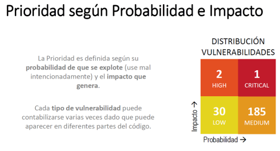

```{r setup, include=FALSE}
knitr::opts_chunk$set(echo = TRUE)
```

## ÍNDICE

1. Business Case
2. Identify source feed
3. Review documentation and schema
4. Identify variables and correlations
5. Define elegant data
6. ETL (Extract, Transform, Load)
7. Visual exploration
8. Document


## 1. BUSINESS CASE

- **User**: CISO, TISO

- **Use Case**: Gestionar los riesgos por vulnerabilidades de aplicaciones web y mobile por sprint.

- **Questions**:

  Q1. ¿Qué tan críticas son las vulnerabilidades?
  
  Q2. ¿Qué vulnerabilidades debería priorizar su mitigación?
  
  Q3. ¿Estoy avanzando en la gestión de estas vulnerabilidades?
  
  Q4. ¿Existen vulnerabilidades comunes a las aplicaciones?
  
- **Metrics**:

  % vulnerabilidades por criticidad → Q1
  % vulnerabilidades por tecnología (lenguaje) → Q1

  % vulnerabilidades críticas de aplicaciones críticas → Q2
  % vulnerabilidades repetidas por aplicación → Q2, Q3

  % vulnerabilidades no tratadas hasta la fecha  → Q3
  % vulnerabilidades críticas no tratadas hasta la fecha  → Q3

  % vulnerabilidades presentes en más de 1 aplicación → Q4
  
- **Actions**:

  A1. Generar tickets manuales para priorizar la remediación.
  
  A2. Informar a áreas responsables de los activos del riesgo asociado.
  
  A3. Determinar la necesidad de capacitación sobre Desarrollo Seguro de Software a un equipo de tecnología específico.
  
  A4. Determinar la necesidad de capacitación sobre la prevención de una vulnerabilidad específica del OWASP.


## 2. IDENTIFY SOURCE FEED

Para el presente trabajo se han buscado diferentes dataset, como:

- DataSet MTRE
- DataSet CVE
- DataSet CWE
- DataSet Fortify

## 3. REVIEW DOCUMENTATION AND SCHEMA

Si bien es cierto la información de los datasets como MTRE, CVE, CWE y Fortify podrían ser un excelente complemento para analizar las vulnerabilidades, para su gestión y tratamiento en base a las criticidades del mismo no aportan valor en específico, dado que la priorización va a depender de la severidad de las mismas.

**¿Qué es Fortify?**
Fortify es una solución de seguridad de aplicaciones. Realiza  pruebas de seguridad de las aplicaciones, la gestión de la seguridad del software y la protección automática de las aplicaciones para ayudarle a asegurar las aplicaciones de manera automática.

**Caso de uso de Fortify:**
Se utiliza para escanear las vulnerabilidades del código fuente de las aplicaciones durante el proceso de integración continua y despliegue continuo.

Permite obtener la Probabilidad e impacto de las vulnerabilidades:


Exporta diferentes reportes según las vulnerabilidades de los estándares de la industria:

 
Para nuestro proyecto hemos incluido dataset de Fortify de las siguientes tecnologías:

- Java

- Kotlin

- PHP

- ObjectiveC


Las cuales correspondes aplicaciones Web y Mobile así como basados en la detección de vulnerabilidades según la guía Owasp Top 10 así como la CWE.


## 4. IDENTIFY VARIABLES AND CORRELATIONS

Para el caso de los 

## 5. DEFINE ELEGANT DATA

Se cargaron en R los datos de los reportes actuales e históricos de Fortify para las aplicaciones de la organización:

```{r message=FALSE,echo=FALSE}
library(readr)
library(dplyr)
library(tidyr)
library(ggplot2)
library(forcats)
```

```{r message=FALSE}
# App1
app1_report <- read.csv("data-csv/App1 - 2021.csv",header = TRUE, sep = ";")
# App2
app2_report <- read.csv("data-csv/App2 - 2021.csv",header = TRUE, sep = ";")
```

Al realizar la importación de los datos, observamos que se obtiene un dataframe, tal como se muestra:
```{r}
class(app1_report)
```

## 6. ETL (Extract, Transform, Load)

Adicionalmente, al hacer la revisión de las variables, se observa que toda la información ha sido importada en su mayoría como character
```{r}
summary(app1_report)
```

Por lo que para poder hacer las operaciones, es necesario poder corregir los tipos de datos antes de poder operar con ellos, sin embargo, dado que todos los dataframes formados tienen la misma estructura y tipos de datos, primero los unimos en un mismo dataframe y luego realizamos las transformaciones respectivas:
```{r}
# Union de reporte
app_report <- rbind(app1_report, app2_report)

# Convierte datos necesarios a datos categóricos
app_report$Application <- as.factor(app_report$Application)
app_report$Language <- as.factor(app_report$Language)
app_report$Category <- as.factor(app_report$Category)
app_report$Criticality <- as.factor(app_report$Criticality)
app_report$Scan.Status <- as.factor(app_report$Scan.Status)
app_report$Impact <- as.factor(app_report$Impact)
app_report$Severity <- as.factor(app_report$Severity)
app_report$Kingdom <- as.factor(app_report$Kingdom)

# Convierte datos necesarios a datos de tipo Date
app_report$Found.Date <- as.Date(app_report$Found.Date)
app_report$Removed.Date <- as.Date(app_report$Removed.Date)

# Convierte datos necesarios a datos de tipo Lógico
app_report$Is.Reviewed <- as.logical(app_report$Is.Reviewed)
app_report$Has.Correlated.Issues <- as.logical(app_report$Has.Correlated.Issues)
app_report$Has.Comments <- as.logical(app_report$Has.Comments)
app_report$Is.Removed <- as.logical(app_report$Is.Removed)
app_report$Is.Suppressed <- as.logical(app_report$Is.Suppressed)
app_report$Is.Hidden <- as.logical(app_report$Is.Hidden)
```

## 7. VISUAL EXPLORATION


Dado que en las 2 primeras métricas [Ver "Metrics"](#business-case) se va a necesitar como denominador común el # de vulns, hacemos el cálculo y lo almacenamos en una variable:
```{r}
num_vulns_actually = nrow(app_report)
```
```{r echo=FALSE}
num_vulns_actually
```

Para el cálculo del 1º indicador, faltaría agrupar las vulnerabilidades en base a su severidad, lo haremos de la siguiente manera:
```{r}
df <- app_report %>% group_by(Severity) %>% summarise(num = n())
```

Por lo que tendríamos el siguiente data frame:
```{r echo=FALSE}
df
```
Dado que ya tenemos el número de vulns por severidad, aprovecharemos esa estructura, para adicionar una columna que represente su % con respecto al total, obteniendo lo siguiente:
```{r}
df[,"Percent"] <- df[,"num"] / num_vulns_actually*100
```
```{r echo=FALSE}
df
```

En base a la información obtenida, la representaremos mediante un gráfico de barras para poder realizar una comparación visual:
```{r echo=FALSE}
df %>%
  mutate(name = fct_reorder(Severity, Percent)) %>%
  ggplot( aes(x=Severity, y=Percent)) +
  geom_bar(stat="identity", fill="red", alpha=.6, width=.4) +
  coord_flip() +
  xlab("Severity") +
  theme_bw()
```

Para obtener el 2º indicador, se relizará la agrupación por tecnología:
```{r}
df_lang <- app_report %>% group_by(Language) %>% summarise(num = n())
```

Por lo que tendríamos el siguiente data frame:
```{r echo=FALSE}
df_lang
```
Dado que ya tenemos el número de vulns por tecnología, aprovecharemos esa estructura, para adicionar una columna que represente su % con respecto al total, obteniendo lo siguiente:
```{r}
df_lang[,"Percent"] <- df_lang[,"num"] / num_vulns_actually*100
```
```{r echo=FALSE}
df_lang
```
En base a la información obtenida, la representaremos mediante un gráfico de barras para poder realizar una comparación visual:
```{r echo=FALSE}
df_lang %>%
  mutate(name = fct_reorder(Language, Percent)) %>%
  ggplot( aes(x=Language, y=Percent)) +
  geom_bar(stat="identity", fill="black", alpha=.6, width=.4) +
  coord_flip() +
  xlab("Language") +
  theme_bw()
```

El último gráfico que muestra que los desarrollos en JAVA tienen la mayor cantidad de vulnerabilidades, sin embargo al hacer una revisión de las severidades observamos que tiene un gran volumen de vulnerabilidades que no son Críticas.
```{r echo=FALSE,message=FALSE}
y<- app_report %>% group_by(Language,Severity) %>% summarise(num = n())
y
```

Ahora bien, dado que requerimos hacer una comparación entre las aplicaciones basado en la criticidad de las vulnerabilidades, procedemos a realizar las agrupaciones correspondientes de la siguiente forma:
```{r message=FALSE}
df_app_severity <- app_report %>% group_by(Application,Severity) %>% summarise(num = n())
```
```{r echo=FALSE}
df_app_severity
```
Por lo que podemos obtener la siguiente gráfica:
```{r echo=FALSE}

df_app_severity %>% ggplot( aes(fill=Severity, y=num, x=Application) ) +
                      geom_bar(position = "dodge", stat="identity") +
                      ylab("Nº Vulns")
```
Ahora para enforcarnos en el % de las vulnerabilidades que tiene cada aplicación como Severidad "Crítica (Severity=5), procedemos a hacer los cálculos respectivos:
```{r}
df_app <- app_report %>% group_by(Application) %>% summarise(num = n())

x <- df_app_severity %>% filter(Severity==5)
x[,"Percent"] <- x[,"num"]/df_app[,"num"]*100
```
Por lo que obtenemos la siguiente información:
```{r echo=FALSE}
x
```
Con dicha información obtenemos la siguiente representación gráfica:
```{r echo=FALSE}
x %>%
  mutate(name = fct_reorder(Application, Percent)) %>%
  ggplot( aes(x=Application, y=Percent)) +
  geom_bar(stat="identity", fill="blue", alpha=.6, width=.4) +
  coord_flip() +
  xlab("Application") +
  theme_bw()
```

De las gráficas mostradas se puede observar lo siguiente con respecto al código de sus aplicaciones en el presente año:

1. Se cuenta con muy pocas vulnerabilidades de severidad Crítica (Severity=5) o Alta (Severity=4)
2. Se observa que la mayor cantidad de vulnerabilidades se encuentra a nivel de JAVA, sin embargo estas en su mayoría son Bajas.
3. La organización debería poner especial atención en la aplicación QWERTY, dado que si bien tiene vulnerabilidades de severidad baja, la unión de ellas puede implicar un riesgo mayor, esto debe qudar a consideración del analista de seguridad.

## 8. DOCUMENT

Repositorio: Github [https://github.com/jorgitux/DDS]
